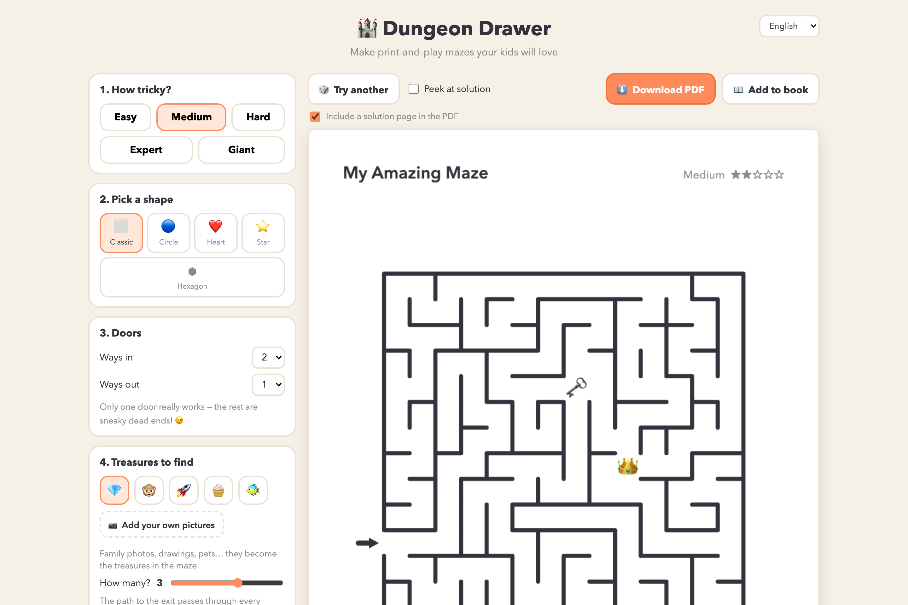
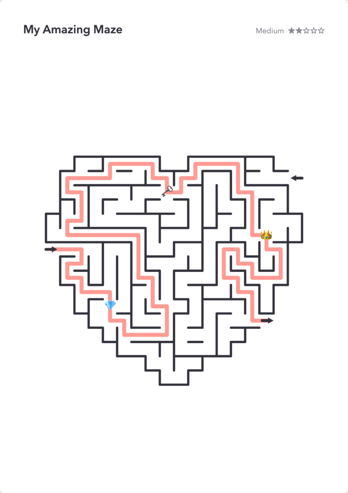
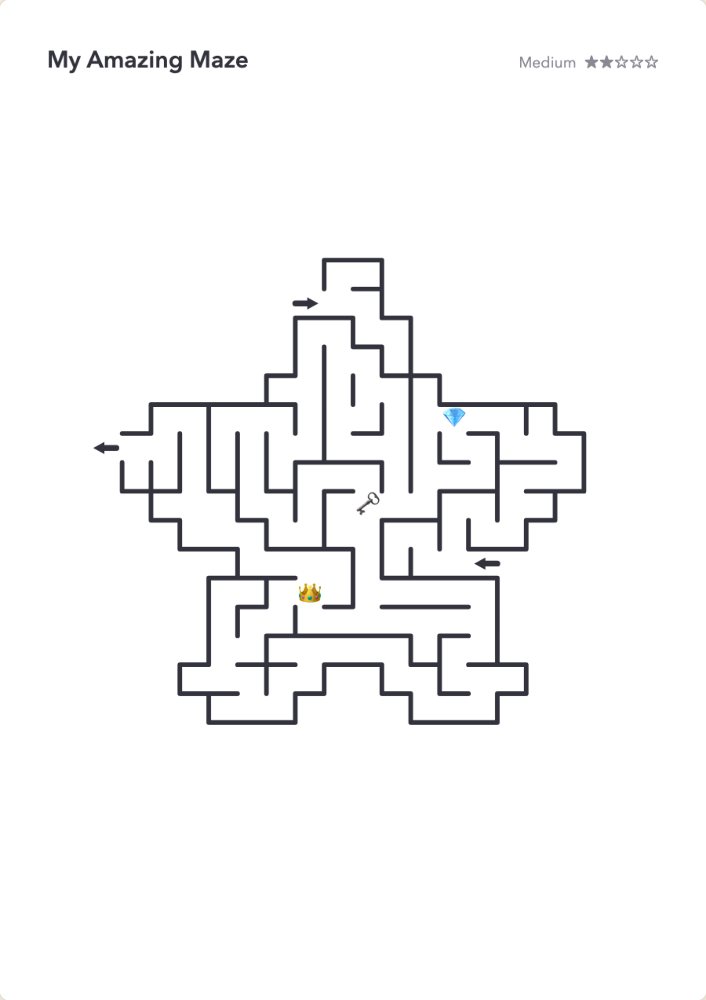
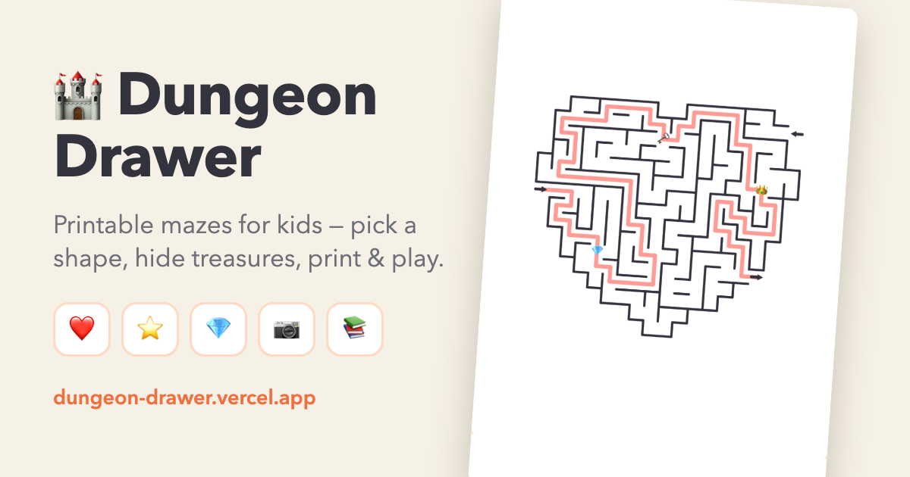
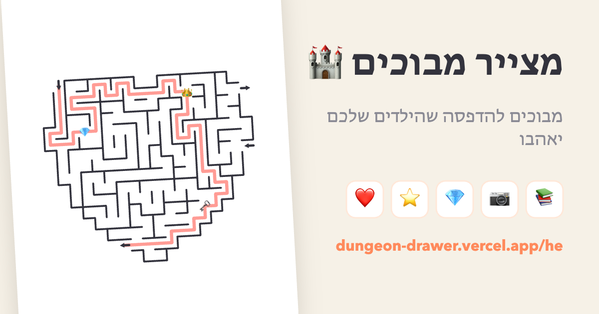

# 🏰 Dungeon Drawer

**▶ Play with it live: [dungeon-drawer.vercel.app](https://dungeon-drawer.vercel.app/)**

A friendly, fully client-side web tool for parents: generate printable mazes ("dungeons") for kids, preview and reroll them until they're just right, and download them as crisp A4 PDFs — single pages or a whole maze book with a cover.

No backend, no accounts, no data leaves the browser — including the language and maze book it now remembers for you.



<p align="center">
  
  
</p>

## Quick start

```bash
npm install
npm run dev      # local dev server with hot reload
npm run build    # typecheck + production build into dist/
npm run preview  # serve the production build locally
```

Requires Node 18+. `npm run build` emits one HTML page per language into `dist/` — see [Languages and URLs](#languages-and-urls). Regenerating the share images is a separate, occasional step: [Regenerating the share cards](#regenerating-the-share-cards).

## Features

| Feature | Details |
| --- | --- |
| **5 difficulty levels** | Easy → Giant, from ~11×11 up to 55×42 cells. Difficulty tunes three knobs, not just size: grid dimensions, route length between the doors, and how many dead ends are opened into loops (see [Difficulty tuning](#difficulty-tuning)). |
| **Shape cutouts** | Classic rectangle, circle, heart, star, hexagon. Doors always sit on the shape outline. |
| **Multiple doors** | Up to 3 entrances and 3 exits — but only one entrance and one exit actually connect. The rest are guaranteed dead ends. |
| **Treasures on the path** | Emoji themes (treasure, animals, space, sweets, ocean) **or your own uploaded pictures** (photos, drawings, pets). The only route to the exit passes through every treasure — this is a verified invariant, not a hope. |
| **Preview & reroll** | Live A4 preview, 🎲 reroll, optional solution overlay. Adding a maze to the book leaves the editor alone — nothing is rerolled behind your back. |
| **Editable book pages** | Click any page on the shelf to load it back into the editor exactly as it was, tweak it, and save it into that page — or leave it and add a new one. |
| **PDF export** | Single maze (~300 dpi A4, optional solution page) or a **maze book**: cover page, one maze per page, optional solutions at the back. |
| **5 languages** | English, עברית (full RTL layout), Español, Français, Deutsch. Printed pages localize too (difficulty label, solution pages, cover subtitle). Each language has its own URL and its own link preview — see [Languages and URLs](#languages-and-urls). |
| **Picks up where you left off** | Your language and your maze book survive a reload, a closed tab, and tomorrow morning. Nothing leaves the browser. |

## Languages and URLs

| URL | What you get |
| --- | --- |
| `/` | English |
| `/he/`, `/es/`, `/fr/`, `/de/` | that language, RTL layout included for Hebrew |
| `?lang=he` on any URL | an explicit override, normalized to `/he/` in the address bar |
| no hint at all | your chosen language from last time (a `dd_lang` cookie), otherwise the browser's |

Each locale is a **real static HTML page** emitted at build time (the `localePages()` plugin in `vite.config.ts`), sharing one JS bundle but carrying its own `<title>`, meta description, Open Graph / Twitter tags, canonical URL and `hreflang` alternates. Link-preview crawlers — WhatsApp, Slack, Facebook, X — don't run JavaScript, so this is the only way a shared link shows up in the right language.

The preview image is localized too: one 1200×630 card per language, drawn with the app's own maze renderer and mirrored for Hebrew ([how to regenerate them](#regenerating-the-share-cards)).

<p align="center">
  
  
</p>

## What's remembered

Nothing is uploaded. Both of these live in your own browser and never travel anywhere.

- **Language** — a `dd_lang` cookie, one year.
- **Your maze book and your pictures** — `localStorage` under `dd_state_v1`: the book title, the solutions-at-the-back toggle, one `{options, seed}` snapshot per maze, and any pictures you uploaded. Because generation is deterministic, reopening the tab re-generates *exactly* the mazes you had rather than approximations of them: a maze made of emoji treasures costs a few hundred bytes to remember, not a saved image. (A maze built from your own photos does carry those photos, which is what can eventually hit the quota below.)

A book is deliberately not kept in a cookie: uploaded photos are data URLs, far past the ~4 KB a cookie holds, and there is no reason to send a maze book to a server on every request. If the browser does refuse the write (storage quota, private mode), the app says so and asks you to download the PDF before closing, instead of quietly forgetting.

## How it works

### Generation pipeline (`src/maze/generate.ts`)

Everything is seeded (mulberry32 PRNG), so the same options + seed always reproduce the same maze — that's how book entries stay stable as lightweight `{options, seed}` snapshots.

1. **Mask** — the shape is sampled into a boolean grid (`src/maze/shapes.ts`, implicit functions); disconnected pockets are dropped so the maze is one region.
2. **Carve** — randomized depth-first search produces a *perfect maze* (exactly one path between any two cells).
3. **Doors** — the start is placed on the boundary far from a random probe; the exit is chosen among boundary cells that are physically distant (≥45% of the diagonal), by *route length quantile* — easier levels take a shorter route, harder levels the longest one.
4. **Decoy doors** — extra openings are made dead ends by walling off their corridor just before it merges with the true solution path. A door that lands in an already-severed region is a free decoy.
5. **Treasures** — waypoints are spread along the middle 70% of the solution path.
6. **Braiding** — on easier levels a fraction of dead ends are opened into loops so young solvers aren't punished by endless backtracking.
7. **Rooms** — walls immediately around each treasure are opened for breathing space.

Steps 6 and 7 mutate a maze that already has decoys and treasures, so **every single wall removal is validated** against three invariants and reverted if any breaks:

- the exit stays reachable from the start;
- every decoy door stays disconnected from the start;
- every treasure remains a *cut vertex* — removing it must disconnect start from exit, i.e. no route can bypass it.

The invariant suite in this repo's history generates 625 mazes (5 shapes × 5 difficulties × 25 seeds) and asserts all three properties plus solvability.

### Difficulty tuning

| Level | Base size | Braid (loops) | Windiness (route-length quantile) |
| --- | --- | --- | --- |
| Easy | 9 | 55% | 0.55 |
| Medium | 14 | 25% | 0.80 |
| Hard | 21 | 10% | 1.00 |
| Expert | 30 | 0% | 1.00 |
| Giant | 42 | 0% | 1.00 |

Rectangle stretches the base size ×1.3 vertically for a portrait page; other shapes use a ×1.25 square grid to compensate for cells lost to the mask.

### Rendering & PDF (`src/render/draw.ts`, `src/pdf.ts`)

One canvas renderer draws everything: the on-screen preview (900 px wide), book-shelf thumbnails (300 px), and PDF pages (2480 px ≈ 300 dpi A4, embedded as PNG via jsPDF). What you preview is exactly what prints.

Page images are handed to jsPDF with explicit `'SLOW'` compression (deflate level 9, Paeth predictor). This is not a micro-optimization: jsPDF stores image data **uncompressed** by default, so an A4 page costs 26 MB of raw pixels and a seven-maze book once came out at 250 MB. With compression the same book is around 2 MB, and because deflate is lossless the print is unchanged.

Draw order is part of correctness: solution line → treasures → **walls on top**. Treasure icons are sized to fit inside a single cell and never cover a wall, so the printed maze is always solvable by exactly what's visible. Emoji are drawn transparently (no backing disc); uploaded pictures are circle-cropped with a thin ring and downscaled to ≤384 px data URLs at upload time (`src/render/images.ts`).

### Localization (`src/i18n.ts`)

Plain typed dictionaries — no i18n framework. The picker in the header switches at runtime, flips `document.dir` for RTL, and re-points the URL, the cookie and the head tags at the new locale.

The language is resolved once at startup, in this order:

1. `?lang=xx` in the query string — an explicit override;
2. the `/<lang>/` path prefix — how a shared link carries its language;
3. the `dd_lang` cookie — what you chose last time;
4. `navigator.language` — first visit;
5. English.

To add a language: add a `Lang` id, a row in `LANGS`, a `Strings` entry and a `SHARE_META` entry (the compiler will list everything that's missing), then regenerate the share cards.

### Regenerating the share cards

`public/og.png` and `public/og-<lang>.png` are generated, not hand-drawn — one 1200×630 card per language, laid out by `scripts/og/` and drawn with the app's own `drawMaze`, so the card and the printed page come from the same renderer. Rerun after changing `LANGS`, `appTitle` or `tagline`:

```bash
node scripts/og/write-server.mjs           # terminal 1 — writes into public/
npm run dev                                # terminal 2
open http://localhost:5173/scripts/og/index.html
```

The page renders every locale, mirrors the layout for Hebrew, and POSTs each PNG to the little writer server. `scripts/` is type-checked by `npm run build` but never bundled — the only Rollup input is the root `index.html`.

## Project structure

```
src/
  App.tsx             UI (controls, preview, book shelf)
  i18n.ts             languages, UI strings, share copy, RTL handling
  share.ts            locale ↔ URL mapping, head/OG tags (build + runtime)
  persist.ts          language cookie, localStorage book + pictures
  pdf.ts              single-maze and book PDF assembly (jsPDF)
  styles.css          app styling
  maze/
    types.ts          shared types, difficulty table
    shapes.ts         shape mask functions
    generate.ts       generation pipeline + safety invariants
  render/
    draw.ts           canvas renderer (preview/thumbnail/PDF pages)
    images.ts         image loading, caching, upload downscaling
scripts/og/           share-card generator (dev only, never bundled)
vite.config.ts        build config + the per-locale HTML page emitter
vercel.json           /he → /he/ redirects, so shares hit the canonical page
```

## Deployment

The build output (`dist/`) is fully static — any static host works. It is multi-page: `dist/index.html` plus `dist/he/index.html`, `dist/es/index.html` and so on, all pointing at the same JS bundle.

**Vercel** (recommended): push to GitHub and import the repo at vercel.com (auto-detects Vite, deploys on every push), or run `npx vercel` for a one-off CLI deploy. The free Hobby plan covers personal, non-commercial use.

**Firebase Hosting**: a `firebase.json` is included (`public: dist`, long-cache asset headers). Note that the `/he` → `/he/` redirect lives in `vercel.json`; on another host you'd want the equivalent rule so link previews resolve to the canonical locale page.

```bash
npm run build
firebase init hosting   # pick a project, keep "dist"
firebase deploy
```

## Analytics

Vercel Web Analytics (`@vercel/analytics/react`, cookieless) tracks page views plus a small set of custom funnel events (`src/analytics.ts`):

```
visit → engage (maze_rerolled · solution_peeked · pictures_uploaded)
      → convert (pdf_downloaded)
      → deepen (book_maze_added → book_downloaded)
```

Events carry low-cardinality props (difficulty, shape, treasure/door counts, whether custom pictures are used, solution-page opt-in, book size, language) so the funnel can be segmented by configuration in the Vercel dashboard without exploding event cardinality.

## Notes

- The `examples/` folder holds reference photos of a commercial maze book used to define the feature set; it is deliberately not committed.
- Uploaded treasure pictures never leave the device: they're data URLs, baked into the generated PDFs and saved to your own browser's `localStorage` so they're still there next time. Clearing site data clears them.
